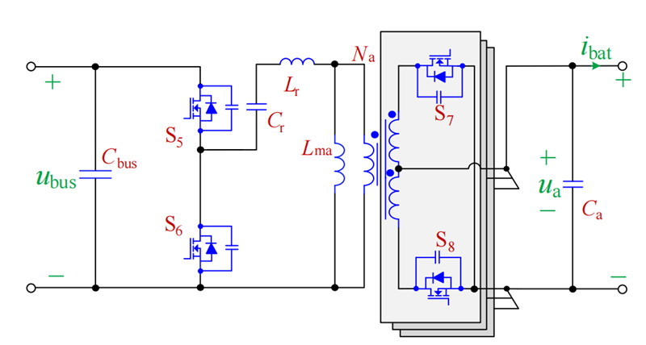
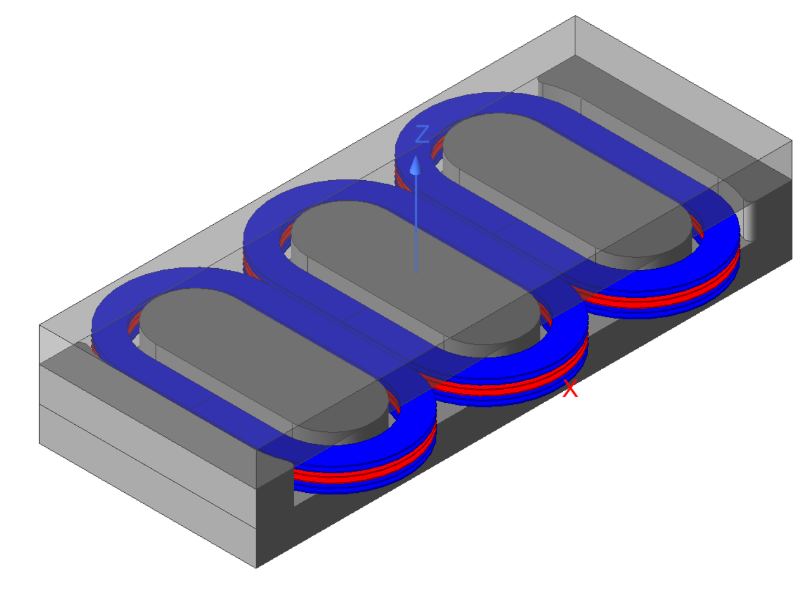
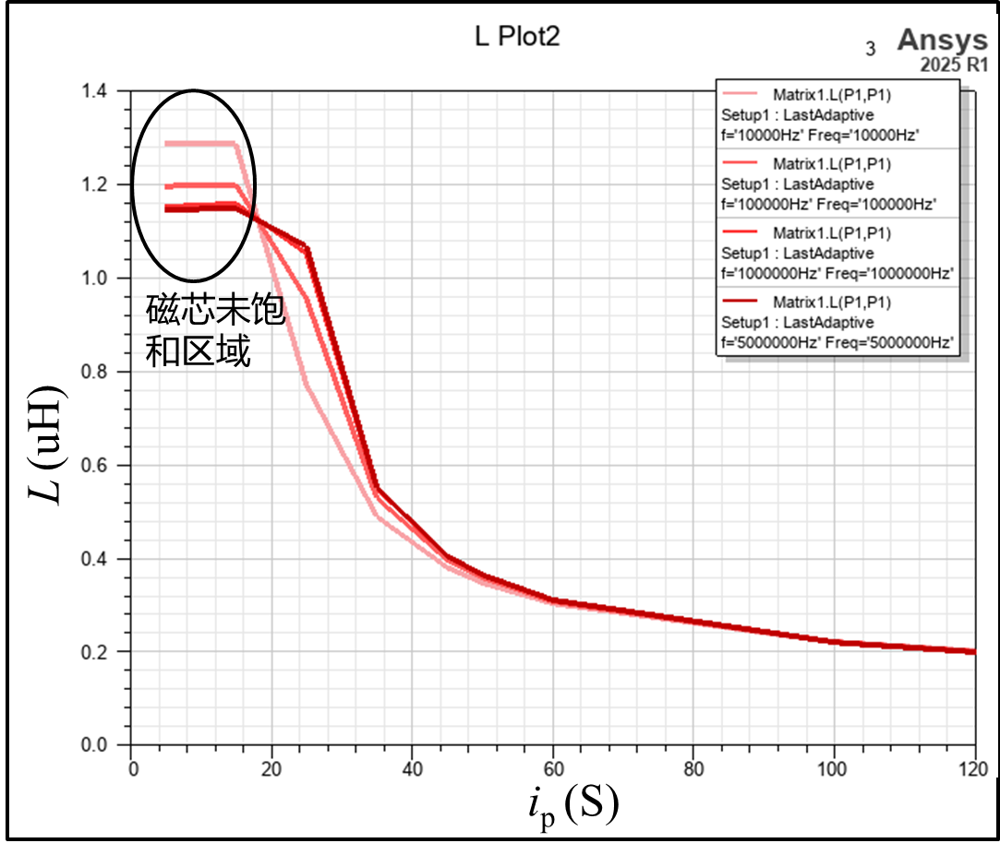

# 一、设计需求案例
设计案例LLC变换器拓扑结构：

变换器参数：

| Vin | 534V  | Po | 500W   |
|-----|-------|----|--------|
| Nps | 6:1:1 | fs | 500kHz |
| Vo  | 44.5V | Lm  | 40uH   |

# 二、设计变压器
变压器具体设计过程略过，最终的结构如图所示：

每个磁芯柱上有两匝原边绕组(红色)串联；两个副边绕组(蓝色)S1、S2，分别串联2匝。最终整个变压器的匝数比是12:2:2。

这个步骤已经确定了变压器的完整尺寸及大致的气隙长度。

# 三、在涡流场中调整气隙长度以满足励磁电感要求

## 3.1 三种场中的电感仿真特点
|        | Magnetostatic     | Eddy Current        | Transient            |
|--------|-------------------|---------------------|----------------------|
| 网格划分   | 可自适应              | 可自适应                | 不可自适应 可导入前两个场的网格 |
| 激励方式   | 直流电压、电流           | 正弦电压、电流             | 任意激励波形、外电路           |
| 电感仿真特点 | 直流激励下的电感值，不包含高频效应 | 包含高频效应，可以反映电感随频率的变化 | 不包含高频效应              |

## 3.2 磁芯材料磁导率设置
|               | 固定磁导率      | BH曲线                       |
|---------------|------------|----------------------------|
| 特点            | 磁导率固定      | 磁导率随激励大小变化                 |
| 对电感的影响        | 电感不随激励大小变化 | 电感会受到激励大小的影响               |
| 对开气隙高磁导率电感的影响 |电感不随激励大小变化| 磁芯未饱和时，电感几乎不受到激励大小影响，如下图所示 |

